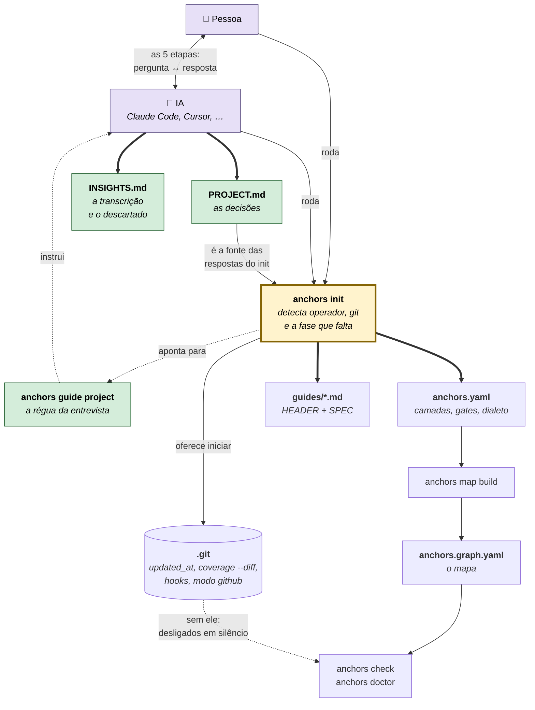
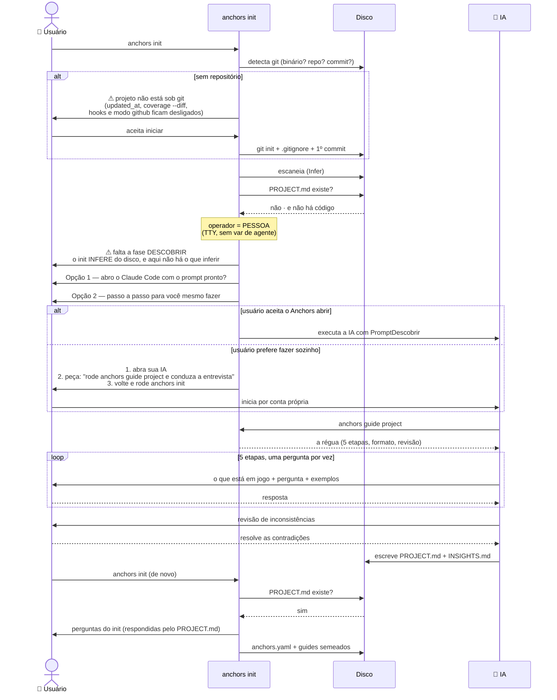
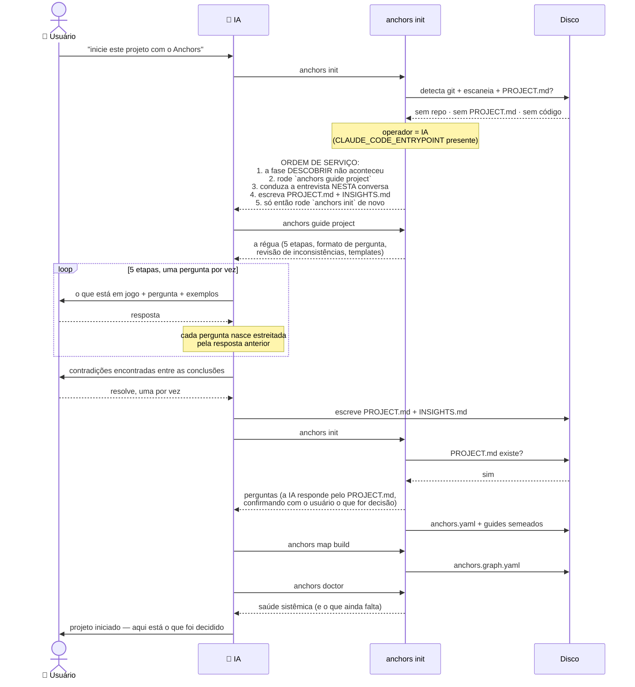
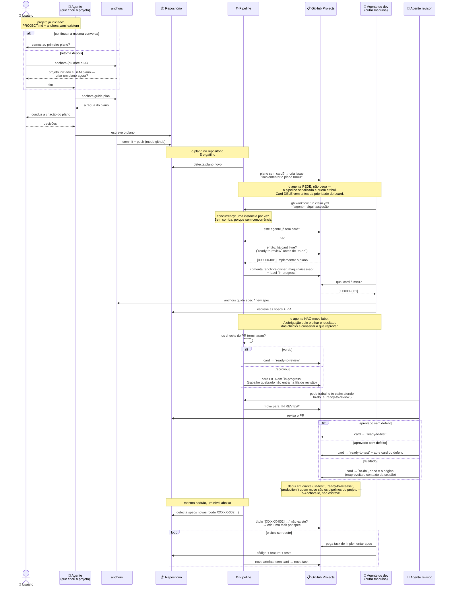

# Anchors — Bootstrap: do diretório vazio ao projeto governado

> **Estado: em construção.** A fase DESCOBRIR (`anchors guide project`) e a etapa de git
> do `init` existem e têm teste. O que ainda NÃO existe é o `init` reconhecer que a fase
> DESCOBRIR não aconteceu e conduzir o usuário até ela — é o que este documento fixa antes
> de implementar.
>
> Complementa o [`WORKFLOW.md`](./WORKFLOW.md), que cobre a fase seguinte: onde a fila de
> trabalho mora (local ou GitHub) depois que o projeto existe.

## 1. O problema

`anchors init` INFERE a Estrutura do que está no disco. Num diretório vazio não há o que
inferir — e ele mesmo sabe disso, porque imprime *"Projeto novo/vazio"* antes de perguntar
"quais diretórios de código tratar como camadas?", cuja resposta honesta é "nenhum ainda".

Existe uma fase anterior, já documentada e implementada como régua (`anchors guide
project`): a **fase DESCOBRIR**, uma entrevista de 5 etapas que produz `PROJECT.md` (as
decisões) e `INSIGHTS.md` (a transcrição). Só depois dela o `init` tem o que perguntar — e
o usuário, o que responder.

O buraco: **nada aponta para essa fase**. Quem roda `init` num diretório vazio segue
respondendo perguntas sem ter as respostas, e a decisão de stack acaba tomada por acidente
no primeiro arquivo que alguém criar.

## 2. A distinção que estrutura tudo: QUEM está operando

O Anchors não embute modelo — quem conduz a entrevista da fase DESCOBRIR é uma IA. Isso
divide o bootstrap em dois fluxos, e o que o `init` deve DIZER muda inteiramente:

| operador | o que a saída do `init` é | o que ele precisa |
| --- | --- | --- |
| **pessoa** num terminal | instrução | saber que a fase existe, e ter como começá-la — inclusive o Anchors abrindo a IA com o prompt pronto |
| **IA** operando o CLI | ordem de serviço | a tarefa descrita: leia o guide, conduza a entrevista NESTA conversa, escreva os dois arquivos |

Escrever um texto só para os dois falha nos dois: a pessoa recebe instruções que não sabe
executar, e a IA recebe um convite quando precisava de uma tarefa.

### Como o Anchors sabe quem é

Em ordem de força da evidência:

1. **Variável de agente conhecida** (`CLAUDE_CODE_ENTRYPOINT`, `CURSOR_TRACE_ID`,
   `AIDER_MODEL`, `GEMINI_CLI`, `CODEX_SANDBOX`) — declaração explícita, e permite NOMEAR
   a ferramenta na mensagem.
2. **`AI_AGENT`** — genérica, mas quem a define está declarando que não é uma pessoa.
3. **Ausência de TTY** — indício fraco (um pipe qualquer produz o mesmo), usado por
   último. Sobra pipe, CI ou agente: nenhum é uma pessoa digitando.

Variável de agente vence a ausência de TTY porque uma IA pode rodar num PTY — o TTY
sozinho classificaria errado.

## 3. Diagrama organizacional — as peças e suas relações



**Legenda:** 🟩 verde = existe e tem teste · 🟨 amarelo = a peça que falta (o `init`
reconhecer a ausência da fase DESCOBRIR e conduzir até ela) · seta cheia = produz · seta
tracejada = informa/depende.

Duas relações no diagrama são o coração do bootstrap: o `init` **aponta** para o guide mas
não o executa (não embute modelo), e o `PROJECT.md` **volta** para o `init` como fonte das
respostas — é o ciclo que fecha o vazio inicial.

## 4. Diagrama de sequência — fluxo 1: a PESSOA chamou o Anchors

O usuário está sozinho no terminal. O Anchors não tem como conduzir a entrevista (não
embute modelo), então instrui — e oferece abrir a IA com o prompt já montado.



## 5. Diagrama de sequência — fluxo 2: a IA chamou o Anchors

O usuário pediu à IA para iniciar o projeto. A IA roda o `init`, e a saída dele é a ordem
de serviço: **a entrevista roda na conversa que já está acontecendo**, sem sair dela.



## 6. A entrevista: etapas e objetivos, não perguntas fixas

O `anchors guide project` **não traz o texto de nenhuma pergunta**, e isso é deliberado.
Ele fixa três coisas, e só elas:

1. **As 5 etapas e sua ordem** — cada uma restringe as opções da seguinte, e inverter
   produz escolha de ferramenta antes de saber para quê.
2. **O objetivo de cada etapa** — o que ela precisa ter decidido para poder terminar
   ("conclua com: linguagem + versão, gerenciador, runtime"). É o critério de pronto.
3. **O formato de toda pergunta** — o que está em jogo (a consequência concreta na
   arquitetura) → a pergunta → exemplos concretos.

| etapa | objetivo (o que precisa estar decidido no fim) |
| --- | --- |
| 1 — Propósito e forma | o que é, quem consome, quais artefatos executáveis nascem |
| 2 — Linguagem e runtime | linguagem + versão, gerenciador, runtime |
| 3 — Arquitetura e paradigma | padrão, paradigma, organização (modular ou em camadas), fronteiras |
| 4 — Estrutura macro e convenções | árvore de diretórios, extensões, padrão de teste, co-location sim/não |
| 5 — Ferramental e formatação | indentação, formatador, linter, convenção de nomes, editores |
| Fechamento | nenhuma contradição restante entre as 5 conclusões |

**Por que não perguntas fixas.** As duas regras que dão valor à fase são incompatíveis com
texto pré-escrito:

- **Ser opinativo** exige usar o que já se sabe das etapas anteriores para eliminar o que
  não cabe. *"Dado que é um time de 1 pessoa com prazo de 2 meses, recomendo monólito
  modular porque X — funciona, ou você tem um motivo forte para outra coisa?"* não é
  escrevível de antemão.
- **Cada pergunta nasce estreitada pela anterior.** Um roteiro fixo faria a etapa 3
  perguntar sobre microsserviços a quem acabou de dizer que está construindo uma CLI.

Um roteiro fixo viraria formulário — e o guide diz explicitamente: *"Você é um arquiteto
sênior conversando, não um formulário"*. O que o Anchors garante não é a pergunta, é o
**objetivo cumprido**: a etapa só fecha quando a decisão que ela existe para tomar está
tomada.

## 7. Depois do projeto iniciado: o plano, e a entrada no fluxo do GitHub

Com o `PROJECT.md` escrito e o `anchors.yaml` no lugar, o projeto tem arquitetura,
estrutura de pastas e convenções — mas ainda não tem trabalho. O próximo passo é o
**plano**, e é ele que dispara tudo o mais.

### 7.1 O plano nasce na mesma conversa, ou depois

Duas rotas, e ambas precisam existir:

- **Continuando** — o mesmo agente que acabou de conduzir a fase DESCOBRIR cria o
  primeiro plano. É o caminho natural: ele tem o contexto inteiro da entrevista fresco.
- **Retomando** — o usuário parou depois do `init` e volta horas ou dias depois. Ao
  entrar (no Anchors ou na IA), **a opção de criar um plano precisa ser oferecida** — um
  projeto iniciado e sem plano é um estado reconhecível, e ficar calado sobre ele deixa o
  usuário sem próximo passo.

### 7.2 O commit do plano é o gatilho

No modo `github`, o Anchors **commita e sobe o plano**. E é aí que o fluxo do GitHub
realmente começa: o plano no repositório é o evento que o pipeline observa.

### 7.3 A regra geral: pipeline detecta artefato órfão, cria o card

O padrão se repete em cada etapa do ciclo, e é sempre o mesmo:

> **Um artefato chegou ao repositório e não tem card que o governe → o pipeline cria o
> card.**

| artefato que apareceu | card que o pipeline cria |
| --- | --- |
| plano | "implementar o plano 00XX" |
| specs (criadas por quem implementou o plano) | uma task por spec a implementar |
| código/feature | task de teste |
| … | … |

Isto responde a pergunta que o [`WORKFLOW.md`](./WORKFLOW.md) §6 deixou aberta — *"quem
cria o card da etapa seguinte?"* — com uma terceira opção que não estava na lista: **nem o
agente encadeando, nem um humano decidindo, mas o CI reagindo ao que apareceu no
repositório**. A vantagem é que o card nasce de um FATO verificável (o arquivo está lá,
sem card), não de alguém lembrar de criá-lo.

### 7.4 Os agentes rodam nas máquinas dos devs

Não há worker central. Cada dev tem um agente na sua máquina — e pode ter mais de um. Eles
não pegam trabalho do board: **pedem ao pipeline**, que é quem atribui (ver §7.6.1). Cada
agente se identifica por **máquina + id de sessão**, porque o usuário do GitHub não os
distingue: dois agentes do mesmo dev têm o mesmo login.

### 7.5 Diagrama de sequência — do plano à implementação



### 7.6 A posse: o `assignee` não serve, e o motivo é estrutural

O `assignee` do GitHub responde *"qual **pessoa** é responsável"*. O Anchors precisa saber
*"qual **agente** está com o trabalho"* — e são perguntas diferentes: **dois agentes na
mesma máquina têm o mesmo usuário do GitHub**. O campo não tem resolução para a pergunta,
e nenhuma esperteza em cima dele resolve isso.

Então os dois campos se separam, e cada um passa a ter uma resposta só:

| campo | responde | quem lê |
| --- | --- | --- |
| `assignee` (nativo) | qual pessoa é responsável | humanos, na UI do GitHub |
| **`anchors-owner`** (comentário) | qual agente está com o trabalho | o Anchors e os agentes |

**O dono-agente vive num comentário estruturado**, e o dono atual é o **último** deles:

```
anchors-owner: <maquina>/<sessao-do-agente>
```

Comentários têm `created_at` — a ordem é **contratual**, não costume. É o que a lista de
`assignees` não oferece: ela é um conjunto de objetos `user`, sem timestamp nem índice de
inserção, então "o último adicionado" depende de uma ordem que a API não promete. Com
comentários, "o último" é uma pergunta com resposta definida.

E o histórico vem de graça, mais rico do que a lista daria: cada reivindicação fica
registrada com data, máquina e sessão. Nada é sobrescrito.

### 7.6.1 Quem atribui é o PIPELINE — a concorrência deixa de existir

Registrar a posse num comentário resolve *quem é o dono* e *em que ordem os claims
chegaram*. **Não resolve a corrida**: dois agentes ainda podem comentar quase ao mesmo
tempo, ambos lerem antes do outro escrever, e ambos se acharem donos. A API não oferece
compare-and-swap; qualquer protocolo em que os agentes disputam tem essa janela.

Então os agentes **param de disputar**. Eles não pegam o card — eles **pedem**, e quem
atribui é o pipeline:

1. O agente **pede trabalho**, disparando o workflow com sua identidade
   (`gh workflow run claim.yml -f agent=<maquina>/<sessao>`).
2. O pipeline — **serializado por `concurrency`, nunca duas instâncias juntas** — escolhe
   um card livre, comenta `anchors-owner: <maquina>/<sessao>` e move para `doing`.
3. O agente **lê qual card recebeu** e começa.

A corrida some porque a decisão acontece num só lugar, uma de cada vez. "Este card tem
dono?" e "atribua a ele" viram uma operação sem ninguém no meio — não porque a colisão é
detectada, mas porque ela não chega a existir.

```sh
# o agente PEDE (não pega)
gh workflow run claim.yml -f agent="$(hostname)/$ANCHORS_SESSION"

# e depois lê o que recebeu
gh issue list --search "anchors-owner: $(hostname)/$ANCHORS_SESSION in:comments" --state open
```

O comentário `anchors-owner` continua sendo o registro — com data, máquina e sessão — mas
**só o pipeline escreve**. Os agentes leem.

> Isto corrige o que o [`WORKFLOW.md`](./WORKFLOW.md) §1 afirma — que o modo `github` ganha
> o claim atômico "de graça (o `assignee` de uma issue)". Não ganha de graça, e nem pelo
> `assignee`: ele não distingue dois agentes do mesmo usuário, e a atomicidade vem da
> serialização do pipeline, não do campo.

### 7.6.2 Cards órfãos: quando a sessão morre

Um agente pode reivindicar e desaparecer — a sessão termina, a máquina desliga. O card fica
em `doing` com um dono que não existe mais, e ninguém o pega, porque tem dono.

**Um pipeline limpa a posse por inatividade:** card parado tempo demais sem progresso vira
`stale`, e o pipeline comenta `anchors-owner: (liberado por inatividade)` — o que faz o
"último `anchors-owner`" deixar de apontar para um agente vivo, devolvendo o card à fila.

O **histórico permanece**: os comentários anteriores ficam lá, e é possível ver quem tinha
pegado, quando, e que foi liberado por inatividade e não por decisão.

### 7.7 A identidade do trabalho: o código no título

Todo artefato do Anchors (spec, plano, feature, teste) carrega um **código gerado** — é a
identidade que amarra a trinca. As issues **registram esse código no título**:

```
[XXXXX-001] Implementar tal coisa
```

É o que torna a pergunta do pipeline respondível: *"existe artefato com código `XXXXX-001`
e nenhuma issue cujo título comece com `[XXXXX-001]`?"* → falta card, crie. Sem essa
convenção, "artefato sem card" não é uma consulta, é um palpite.

### 7.8 O pipeline de identificação é SEQUENCIAL

Duas execuções concorrentes do pipeline veriam o mesmo artefato órfão e criariam dois cards
para ele. A idempotência não vem de esperteza no código, vem da **serialização**: este
pipeline nunca roda em paralelo consigo mesmo (no GitHub Actions, `concurrency` com grupo
fixo e sem cancelamento).

### 7.9 O ciclo de revisão

O agente que implementa não fecha o próprio trabalho, e não move o próprio card. Ao subir
o código e abrir o PR, ele espera: **quem move para `READY TO REVIEW` é o pipeline de PR,
e só quando os checks PASSAM.**

A obrigação de quem abriu o PR passa a ser uma só — olhar o resultado e consertar o que
reprovou. Enquanto houver check vermelho, o card fica em `IN PROGRESS`, porque é a
verdade: o trabalho não terminou.

Isso vale mais pelo que impede do que pelo que automatiza. Com o agente movendo a label,
`READY TO REVIEW` significava "alguém achou que estava pronto" — e um PR que nem passa nos
checks entrava na fila de revisão, gastando o revisor com o que a máquina já sabia
reprovar. Agora a coluna significa "os checks passaram".

Dali, outro agente o pega (pelo mesmo pipeline de claim, que também atende essa coluna),
movendo-o para `IN REVIEW`.

**O revisor corrige o que é defeito de execução.** Marcação no lugar errado, opção
faltando, teste que não cobre o caso: ele já sabe qual é o certo, e devolver faria outro
agente descobrir o que ele acabou de descobrir. O card volta para `READY TO REVIEW` — quem
corrige vira autor daquele trecho, e não aprova o próprio conserto.

**Devolve o que é defeito de entendimento.** A spec foi lida errado, a abordagem não
serve: aqui corrigir seria pior que moroso, porque esconderia que o autor entendeu errado,
e o mesmo erro volta no próximo card que ele pegar.

A aritmética favorece o primeiro caminho, e é o argumento que decide: quando há correção,
são DOIS reviews de qualquer forma. A diferença é que o convencional (revisor comenta →
autor corrige → outro revisa) tem mais dois `claim` e uma releitura no meio — e o autor,
que já tinha descarregado o contexto, precisa reconstruí-lo para uma correção que o
revisor sabia fazer.

O risco do caminho novo é o card circular entre revisores para sempre, cada volta
parecendo progresso. Por isso o pipeline CONTA as revisões e escreve o número no card —
quem pega a sétima precisa saber disso antes de começar a ler, para procurar o desacordo
em vez de opinar do zero.

Na terceira, um aviso: quando a revisão não converge, o problema costuma estar antes do
código — a spec não decide o que precisava decidir, e cada revisor lê o vazio de um jeito.

Na **décima**, o card sai da alçada dos agentes. Ganha `anchors:precisa-do-usuario` e o
claim deixa de entregá-lo: dez revisões sem convergir não é problema de código, é uma
decisão que ninguém tomou, e a décima primeira produziria a décima segunda.

A label é um EIXO à parte do estado — o card continua na coluna onde o trabalho parou, e
o que muda é quem pode destravá-lo. Fosse estado, o card sairia dessa coluna e o board
deixaria de mostrar onde o fluxo travou.

Três desfechos:

| desfecho | o que acontece com o card |
| --- | --- |
| **aprovado, sem defeito** | vai para `READY TO TEST` |
| **aprovado, com defeito** | vai para `READY TO TEST` **e** abre-se um card novo para o defeito |
| **rejeitado** | volta para `TO DO` **com o dono original** |

A devolução ao dono original não é cerimônia: é **reaproveitamento de contexto**. O agente
que escreveu o código ainda tem a sessão com o raciocínio inteiro; mandar a correção para
outro agente joga esse contexto fora e paga de novo o custo de entender o problema.

### 7.10 A retomada: `anchors status`

**A volta ao trabalho é sempre iniciada pela IA** — não existe "voltar direto no Anchors",
porque o Anchors não tem comando para isso. Mas o agente que retoma precisa saber ONDE o
projeto está, e hoje não tem como perguntar.

Daí um comando novo: **`anchors status`** — o estado atual do projeto, legível por pessoa e
por agente, com os próximos passos que ele implica.

| estado detectado | próximo passo que o `status` indica |
| --- | --- |
| diretório vazio, sem `PROJECT.md` | a fase DESCOBRIR (§4/§5) |
| `PROJECT.md` existe, sem `anchors.yaml` | `anchors init` |
| iniciado, sem plano | criar o primeiro plano |
| plano existe, sem card | o pipeline vai criar — ou crie manualmente |
| cards em `doing` | quais, de quem, desde quando |
| … | … |

É o que fecha o §7.1: a oferta de criar um plano na retomada não é um caso especial do
`init`, é uma linha do `status`.

### 7.11 Quem fecha, quem revisa

- **Quem tira o card do fluxo do Anchors é o agente de review**, movendo-o para `READY TO
  TEST`. Nunca quem implementou: aprovar o próprio trabalho elimina a única etapa em que
  outro par de olhos olha antes de o card sair da alçada do framework.
- **Com um agente só, ele revisa o próprio trabalho.** É o pior caso, não o desenho — mas
  é melhor do que não ter etapa de revisão: `READY TO REVIEW` → `IN REVIEW` continua
  existindo como o momento em que se olha o PR com a pergunta "isto está pronto?", ainda
  que seja a mesma sessão.

### 7.12 `anchors status` no modo local

O `status` mostra o que o modo em vigor tem para mostrar: no `github`, os cards do board;
no `local`, a fila em `.anchors/tasks/` e as issues em `issues/todo|doing|done`. É a mesma
pergunta — *onde o projeto está?* — respondida com a fonte que aquele modo declara.

### 7.13 O estado do trabalho é uma LABEL

**O estado de um card vive numa label**, e o GitHub Project é um espelho **opcional**.

> **Esta decisão foi invertida no uso.** A primeira versão pôs o estado na COLUNA do
> Project, com o argumento de que estado em dois lugares dessincroniza. O argumento
> continua válido — mas o custo só apareceu quando o fluxo rodou pela primeira vez:
> escrever num Project de organização exige um PAT com escopo `project`, que o
> `GITHUB_TOKEN` da Action **não tem**. Todo projeto que adotasse o fluxo precisaria criar
> e manter um token pessoal antes de o primeiro card se mover — atrito de adoção cobrado
> por uma decisão de visualização.
>
> Com label, o `GITHUB_TOKEN` basta e não há nada a configurar. E o board não some: a
> automação nativa do Projects move o card quando a label muda. A preocupação original
> some junto, porque **só um lado escreve** — nós na label, o GitHub no board.

#### Os estados (labels `anchors:*`)

Oito, e seguem um par: **`ready-to-x`** é trabalho disponível para alguém pegar; **`in-x`**
é alguém fazendo. É esse par que torna a fila legível — o claim procura nos `ready-to`, e
nunca precisa adivinhar se um card em andamento está parado ou ativo.

| label | significa | quem move para cá |
| --- | --- | --- |
| `anchors:to-do` | implementação disponível, sem dono | identificação (ao criar) · revisor (ao rejeitar) · stale (ao liberar) |
| `anchors:in-progress` | um agente está implementando | o pipeline de claim |
| `anchors:ready-to-review` | PR **verde**, esperando revisor | o pipeline de PR (só quando os checks passam) |
| `anchors:in-review` | um agente está revisando | o pipeline de claim |
| **`anchors:ready-to-test`** | **aceito no review — o fim da alçada do Anchors** | o agente revisor, ao aprovar |
| `anchors:in-test` | em teste | *pipeline do usuário* |
| `anchors:ready-to-release` | teste passou | *pipeline do usuário* |
| `anchors:production` | no ar | *pipeline do usuário* |

**O Anchors escreve até `ready-to-test`, e para.** Os três últimos pertencem ao pipeline
de entrega do projeto — cada time tem o seu, e o Anchors não tem o que dizer sobre quando
um teste de aceitação passou ou um deploy aconteceu. Ele continua LENDO esses estados (o
`anchors status` mostra onde cada trabalho está), mas não escreve neles.

O caminho é de mão única, com uma exceção: **`in-review` volta para `to-do`** quando o
revisor rejeita — e volta com o dono original registrado, para reaproveitar o contexto da
sessão que escreveu aquele código (§7.9).

#### O board, se você quiser um

Crie um GitHub Project com uma coluna por estado (`TO DO`, `IN PROGRESS`, `READY TO
REVIEW`, `IN REVIEW`, `READY TO TEST`, `IN TEST`, `READY TO RELEASE`, `PRODUCTION`) e
ligue a automação nativa: *label adicionada → move para a coluna*. Uma vez, pela UI.

Nenhum pipeline toca o Project — e há teste que impede a volta: um `gh project` num
workflow reintroduz o PAT e o atrito.

#### O que NÃO é label

O **dono-agente** vive num comentário `anchors-owner: <maquina>/<sessao>` (§7.6), não numa
label, porque o histórico importa: quem passou pelo card, quando, e se saiu por decisão ou
por inatividade. Label guarda só o valor atual.

O **`assignee` nativo** continua sendo da pessoa, no uso normal do GitHub.

#### A label que separa os cards do Anchors dos demais

O repositório é compartilhado: ele carrega issues de produto, de infraestrutura, do que o
time quiser. Um agente que lesse só o estado pegaria uma issue de produto que alguém
tivesse rotulado igual.

Por isso **todo pipeline cruza DUAS labels**: a do `workflow.labels` (o quintal do
Anchors) e a do estado (a fila). Uma sem a outra não basta.

#### O que o `doctor` confere

| peça | como | escopo |
| --- | --- | --- |
| os 3 workflows em `.github/workflows/` | ler o disco | nenhum |
| `concurrency` sem cancelamento nos 3 | ler o YAML | nenhum |
| as labels de estado | `anchors doctor --fix` as cria | `repo` |

O board **não** é conferido: é opcional, e cobrar uma peça que o fluxo não usa produziria
um achado que ninguém precisa resolver.

### 7.14 O ambiente precisa estar configurado — e alguém tem de garantir isso

Todo o fluxo da §7 pressupõe os quatro pipelines no lugar e as labels de estado criadas. Se qualquer peça faltar, o fluxo não falha ruidosamente: **ele simplesmente não
acontece**. Um pipeline de identificação ausente não gera erro — gera silêncio, e os
artefatos ficam sem card para sempre. É a mesma classe de problema que a falta de git, e
merece o mesmo tratamento: `init` e `doctor` avisam com antecedência.

A lista do que precisa existir está na §7.13.

**`doctor --fix` conserta o que é consertável.** O `doctor` sem flag continua sendo
diagnóstico puro — *"nada foi bloqueado; decida o que conciliar"* —, e com `--fix` cria o
que falta. É o precedente do `check --fix`, que já existe no projeto.

O que ele pode criar sozinho, e o que não pode:

**Cria** os workflows (arquivos do repo, versionados e revisáveis num diff) e as labels
de estado (triviais e reversíveis, e o único pré-requisito do fluxo que não é arquivo).

**Não toca o board** — ele é opcional (§7.13), e a automação que o mantém em dia é
configurada uma vez pela UI do Projects.

### 7.15 Os dois fluxos: convergir aos poucos

O Anchors nasceu com o fluxo local (`.anchors/tasks/`, `issues/todo|doing|done`) e agora
ganha o do GitHub. São **dois fluxos diferentes que toda feature futura vai ter de
conciliar** — um custo recorrente, e a razão para eles convergirem em algum momento.

**Direção registrada, sem data:** migrar o local aos poucos até coincidir com o do GitHub,
em vez de manter duas lógicas em paralelo. A forma provável é extrair as regras dos
pipelines (hoje em YAML de Actions) para comandos Go, com o lugar onde os cards moram
virando um detalhe trocável — issues+Project de um lado, arquivos do outro. O Actions
passaria a ser uma casca de três linhas chamando o mesmo comando que um processo local
chamaria.

Duas peças para isso **já existem**: `internal/daemon` (daemonização, PID, log, pausa —
o "processo que fica rodando") e o claim atômico por rename do `internal/queue`.

**O que a pesquisa já descartou** (para não repetir a investigação):

| candidato | por que não serve |
| --- | --- |
| "um LocalStack do GitHub" | não existe — e não pode existir para este uso: o `gh` só aceita `GH_HOST` de GitHub Enterprise, nunca de implementação de terceiros |
| Gitea/Forgejo como backend local | forge real em Go, mas a API é *inspirada* na do GitHub, não compatível (`/api/v1` vs `/api/v3`, SDK próprio). O `gh` não fala com ele, e o usuário passaria a manter um servidor |
| `google/go-github` apontando para Gitea | não funciona: APIs distintas no fio. Gitea mantém `code.gitea.io/sdk/gitea` justamente por isso |
| `jenkins-x/go-scm` / `git-pkgs/forge` | abstraem vários forges (o primeiro até com driver `fake` in-memory), mas **nenhum cobre Projects** — e o board é onde o estado do trabalho mora (§7.13). Além disso, SDK reintroduz o token que o `WORKFLOW.md` §4 evitou de propósito |
| copiar trechos dessas bibliotecas | Apache 2.0 e MIT exigem preservar aviso e licença — mistura ruim num projeto BSL, e importar como módulo seria mais simples e mais seguro de qualquer forma |

O que essas bibliotecas resolvem é **transporte** (falar HTTP com o forge). O trabalho que
sobra — a regra do artefato órfão, a prioridade da direita para a esquerda, a posse por
`anchors-owner`, a serialização — é do Anchors por definição, e é a maior parte.

**Por que não agora:** o fluxo do GitHub ainda não rodou em projeto nenhum. Unificar antes
disso é projetar a abstração sem saber quais operações realmente importam — e a §7 ainda
tem pontos abertos que só o uso responde.

### 7.16 Um plano revisado, e os cards que já estão no board

Revisar um plano deixa cards descrevendo trabalho sob a régua antiga. O que fazer com cada
um depende de **quanto trabalho já foi investido** — e a resposta não é a mesma em todas
as colunas:

| coluna | ação | por quê |
| --- | --- | --- |
| `TO DO` | **fecha** | ninguém pegou, e o plano que revisa semeia a spec nova. Um card aberto sobre a régua antiga é convite a trabalho descartável |
| `IN PROGRESS` | comenta | alguém está codificando, e isso vai passar por review de qualquer forma |
| `READY TO REVIEW` · `IN REVIEW` | comenta | a revisão acontece de todo jeito; o comentário é o contexto que o revisor precisa |
| `READY TO TEST` em diante | **nada** | já foi mesclado. O que mudou vira trabalho novo, e reabrir apagaria a entrega |

**A decisão tem um lugar, e é o review.** Um card em andamento não é escalado a ninguém: o
revisor terá o trabalho pronto à vista, e a pergunta que ele responde não é "está certo?"
— é *"aceitar dá menos trabalho que rejeitar?"*, porque quem for implementar o plano
revisado herda o que entrar.

Escalar antes disso pediria uma decisão sobre algo que ninguém viu, e pararia o trabalho
para obtê-la. Criar um segundo lugar para uma decisão que já tem lugar natural só a
antecipa sem informação.

**O aviso vai só para as fases atingidas.** O `revises` diz que o plano mudou; as marcações
de parte dizem onde. Avisar todas as specs por causa de uma fase alterada é o ruído que
faz o aviso deixar de ser lido — e quem recebe um aviso que não se aplica aprende a
ignorar o próximo, que se aplica.

### 7.17 O CI roda o binário PUBLICADO, não o seu

Duas armadilhas da mesma família, e as duas mordem em silêncio: **o que vale no seu
terminal não vale no CI até você publicar.**

**O binário.** Os pipelines baixam o release (`ANCHORS_VERSION: latest`), e não compilam
do fonte. Toda mudança no *schema* do `anchors.yaml` — um campo novo, um valor que passa a
aceitar lista — exige um release antes de valer no CI. Sem ele, o pipeline falha com
`field X not found`, ou pior: **lê o arquivo e ignora o campo que não conhece**, e o mapa
sai incompleto sem que nada acuse.

Aconteceu três vezes numa sessão. A terceira foi a mais cara de ver, porque não deu erro:
o board publicava as fases mas com `parent` vazio em todos os cards, e a árvore saía
plana. O binário antigo simplesmente não lia o campo.

**O branch.** Workflow agendado (`schedule`) e `workflow_run` rodam do **branch padrão**,
não do que você está trabalhando. Uma correção de pipeline só passa a valer quando chega
lá — e enquanto não chega, a versão defeituosa continua rodando a cada 30 minutos.

Foi o que manteve um `stale` quebrado reciclando trabalho pronto por horas, depois de
corrigido na develop.

**O que fazer:**

- mudou o schema do `anchors.yaml`? publique o release ANTES de esperar o CI funcionar;
- corrigiu um pipeline agendado? ele só vale depois de mesclar no branch padrão;
- e quando um pipeline "funciona mas o resultado está errado", suspeite da VERSÃO antes
  de procurar o defeito no código.

### 7.18 O que ainda não está resolvido

- **Como o agente sabe QUAL card recebeu**, sem ficar consultando em laço? O
  `workflow_dispatch` não devolve resultado ao chamador; o agente precisa consultar depois,
  e falta definir o critério de parada dessa consulta.
- **O pipeline escolhe qual card** quando há vários livres? Ordem de criação, prioridade
  declarada, ou o que estiver mais acima no board?
- **Um agente pode ter mais de um card ao mesmo tempo?** Se não, o pipeline precisa checar
  antes de atribuir.
- **Quanto tempo em `doing` sem progresso** faz um card virar `stale`? E o que conta como
  progresso — commit, comentário, movimento de coluna?
- **O `doctor --fix` sobrescreve um workflow que o time editou à mão?** Um pipeline
  customizado não pode ser reescrito pelo padrão — mesma régua do `install-hooks`, que
  respeita um pre-commit alheio a menos que venha `--force`.
- **Os nomes das colunas são fixos ou configuráveis?** As oito aparecem cravadas nos
  pipelines; um time que já usa outro board teria de renomear tudo.
- **O `anchors status` deve mostrar as colunas pós-`READY TO TEST`?** Ele as lê, mas o
  Anchors não governa o que acontece lá — mostrar pode dar a impressão de que sim.

## 8. Decisões tomadas

| decisão | por quê |
| --- | --- |
| Git é **aviso** no `init`, **erro** no ponto de uso | falta de git não impede escrever o `anchors.yaml`; quem depende dele cobra onde a ação acontece, com a mensagem que nomeia QUAL ação ficou incompleta |
| "git não instalado" ≠ "git não iniciado" | a AÇÃO é diferente: sem binário não há `git init` a oferecer, e mandar instalar quem já tem git manda procurar onde o problema não está |
| `init` e `doctor` avisam com antecedência | são os comandos cujo trabalho É antecipar — os demais avisam no ponto de uso |
| A fase DESCOBRIR não é bloqueio | mesma régua do git: o Anchors detecta e apresenta, não arbitra (`CONCEPT.md` §2) |
| Um `PROJECT.md` presente dispensa a fase | ele é a prova de que ela rodou, mesmo num diretório ainda sem código — que é o estado em que ela DEVE deixar o projeto |
| Código presente dispensa a fase | há o que inferir do disco; a fase existe para o vazio |
| O prompt manda LER o guide, não o resume | `anchors guide project` é a fonte da verdade; um prompt que a resumisse desatualizaria em silêncio na primeira mudança |

## 9. Perguntas em aberto

- **Quando o `init` roda pela 2ª vez, ele deve LER o `PROJECT.md`** para pré-preencher as
  respostas (stack, extensões, co-location), ou só reconhecer que existe? Ler elimina a
  redigitação, mas depende de o arquivo seguir o template.
- **O que fazer quando o `PROJECT.md` existe e CONTRADIZ o disco?** (declara Go, e o disco
  tem `.ts`). É achado de `doctor`, aviso do `init`, ou nada?
- **A oferta de abrir a IA deve existir mesmo quando o Anchors não sabe qual abrir?**
  Hoje só há comando estável para Claude Code, Gemini CLI e Aider.
- **`INSIGHTS.md` deve ser versionado?** O `USING.md` não diz. É transcrição, cresce, e
  ninguém relê — mas é a única resposta para "por que Postgres e não Mongo?".
