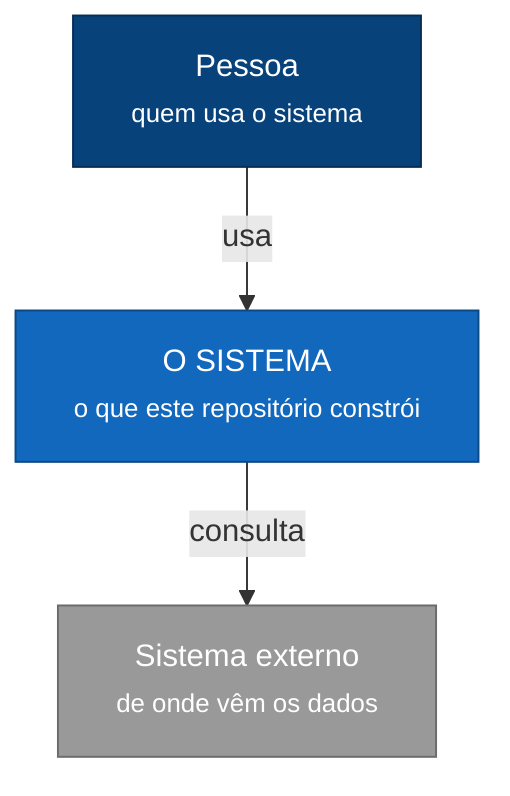

<!-- anchors:generated from doct/arquitetura.md.tmpl — inputs:0341e111430cd376 — DO NOT EDIT: run `anchors docs build` -->

# Arquitetura

## Nível 1 — Contexto

O sistema como uma caixa só: quem o usa, e com que sistemas externos ele fala.

<!-- FORA deste nível: como o sistema é montado por dentro. Isso é o nível 2. -->

## Nível 2 — Contêineres

O zoom da caixa "O SISTEMA": o que roda ou armazena separado, e **com que protocolo cada
par conversa**. O protocolo é o que diz o que acontece quando a conversa falha.

> **Nenhum contêiner declarado.** O nível 2 e os de nível 3 saem vazios até a Estrutura
> declarar o que roda separado. Ver o bloco de contêineres no `anchors.yaml`.

<!-- FORA deste nível: as peças DENTRO de cada contêiner. Isso é o nível 3 — e há um
     diagrama por contêiner, porque cada nível amplia UMA caixa do anterior. -->

## Nível 3 — Componentes

Um diagrama **por contêiner**: cada um amplia uma caixa do nível 2. Os externos não
aparecem aqui — não temos componentes dentro deles, e desenhá-los afirmaria um
conhecimento que não temos.

### Camadas fora de todo contêiner

Estas camadas existem no projeto e nenhum contêiner as declara — não aparecem em diagrama
de nível 3 nenhum. Ou falta declará-las, ou elas não rodam em lugar nenhum:

- `gate`

## Nível 4 — Código

<!-- Só onde houver algo não óbvio. O mapa que o Anchors mantém já é a versão de
     máquina, e repeti-lo aqui seria duplicação sem leitor. -->

_Nada a destacar por enquanto._
